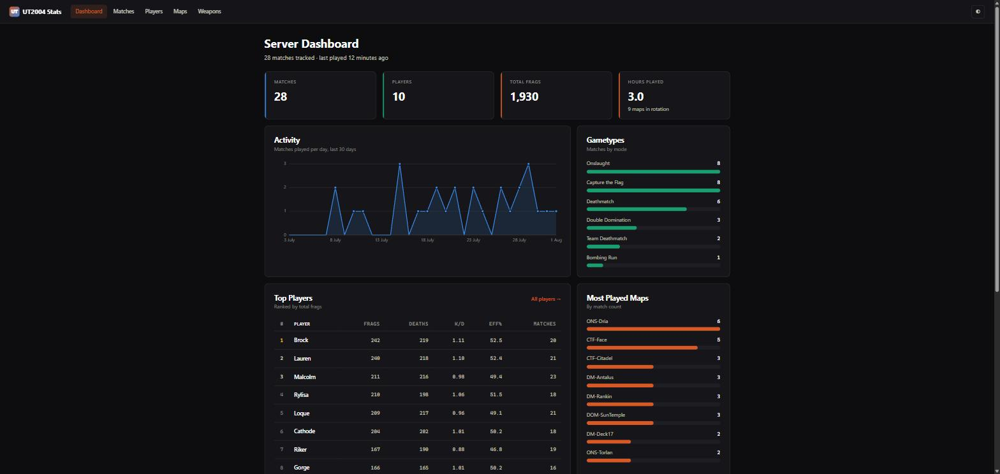

# UT2004 Stats

A modern stats site for an **Unreal Tournament 2004** dedicated server. It reads the
logs the game engine already writes and turns them into match reports, leaderboards,
player profiles and weapon breakdowns.

Built with .NET 10 (Blazor + EF Core + SQLite). No PHP, no MySQL, no cron job, and
nothing to click to import — matches appear on their own as they finish.



## Why

The classic tool for this is [UTStatsDB](https://github.com/shrimpza/utstatsdb) — PHP
from 2002, still works, but it needs a manual "parse logs" trigger (or a cron job),
and the UI is of its era. This is a rewrite with the same input format and a
different set of priorities:

| | UTStatsDB | This |
|---|---|---|
| Imports | manual trigger or cron | automatic, on a timer |
| Storage | MySQL / SQLite / MSSQL | SQLite, single file |
| Deploy | web server + PHP + DB | one container |
| Weapons | one row per damage type | fire modes grouped per weapon |
| Theme | fixed | light + dark, follows the OS |

## Quick start

The server must be writing stats logs — see [Server setup](#server-setup) below.

```bash
git clone https://github.com/danpowell88/ut2004-stats.git
cd ut2004-stats

# Point ./data/logs at your server's stats directory, then:
docker compose up -d --build
```

Open <http://localhost:8078>.

To run it directly against a directory of logs without Docker:

```bash
dotnet run --project src/Ut2004Stats.Web \
  --Stats:LogDirectory=/path/to/UserLogs \
  --Stats:DatabasePath=./ut2004stats.db
```

## Configuration

Set via `appsettings.json`, or as `Stats__*` environment variables.

| Setting | Default | Meaning |
|---|---|---|
| `Stats:LogDirectory` | `/data/logs` | Where the game server writes its stat logs |
| `Stats:DatabasePath` | `/data/db/ut2004stats.db` | SQLite file location |
| `Stats:ScanInterval` | `00:01:00` | How often to look for finished matches |
| `Stats:ScanOnStartup` | `true` | Import everything already present on boot |

The database is disposable — delete it and every log is re-imported on the next
scan. Imports are idempotent, keyed on the log file name, so a re-scan never
duplicates a match.

## Server setup

UT2004 has stats logging built in; no mutator is required. In your server's
`UT2004.ini`:

```ini
[Engine.GameInfo]
bEnableStatLogging=True
GameStatsClass=Engine.GameStats

[Engine.GameStats]
bLocalLog=True
```

`GameStatsClass` matters: the stock value is `IpDrv.MasterServerGameStats`, which
targets Epic's master server (decommissioned in 2023). `Engine.GameStats` is the
local-only logger.

Logs land in the server's `UserLogs/` directory as
`Stats_<port>_<yyyy>_<MM>_<dd>_<HH>_<mm>_<ss>.log`. Mount that directory as
`/data/logs`. A match in progress is written as `.log.tmp` and is ignored until
the engine finalises it.

### What counts as a match

Only games that actually reached a conclusion are imported — a frag limit, time
limit, score limit, round limit, last-man-standing or a draw. Matches ended by a
map change or a server restart are skipped, as are warm-up rounds. This mirrors
UTStatsDB's behaviour and keeps abandoned games out of the ladder.

## Notes on the log format

A few things worth knowing, since they shape what the site can show:

- **Killing sprees are derived, not logged.** The engine emits `spree_N` events, but
  they don't carry the streak length, so sprees are reconstructed from runs of
  consecutive kills (5 = Killing Spree, 10 = Rampage, … 30+ = Wicked Sick).
  Multi-kills *are* logged explicitly and are read as-is.
- **Bots can't be identified** from a stock log — the connect record carries no bot
  flag. Modded loggers that prefix names with `[BOT]` are detected. Bots are
  excluded from the leaderboard by default; there's a toggle on the Players page.
- **Headshots have no event of their own**; they're inferred from the damage type.
- **Warm-up is discarded.** Everything before the start-of-game record is thrown
  away, so pre-match messing about doesn't pollute the stats.
- **Both fire modes group under one weapon** — a flak shell and a flak chunk are
  both "Flak Cannon", which is usually what you actually want to know.

## Development

```bash
dotnet test     # 62 tests: log parsing and import behaviour
dotnet build
```

```
src/Ut2004Stats.Core     domain model, log parser, importer, queries
src/Ut2004Stats.Web      Blazor UI
tests/…Core.Tests        parser + importer tests
```

The parser (`Parsing/StatsLogParser.cs`) is the interesting part and is covered by
tests using synthetic logs that follow the real format, including the awkward
cases: warm-up resets, suicides, team kills, environmental deaths, UTF-16 logs,
truncated lines and files containing more than one match.

### Design

Chart colours come from a categorical palette validated for colour-vision
deficiency (adjacent-pair separation, contrast against both surfaces). Bars carry
their value as a direct label rather than relying on colour or on reading against
an axis, and team red/blue is used only where it's semantically the game's own
team colour.

## Licence

MIT
